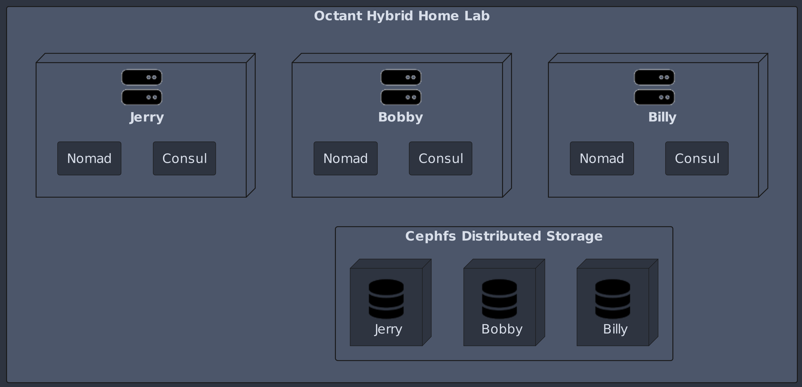
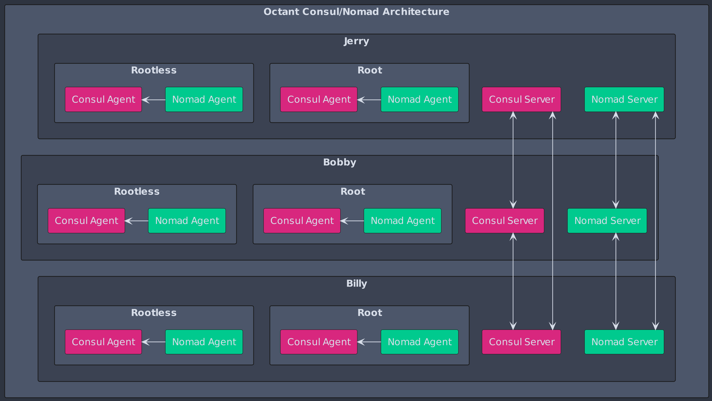
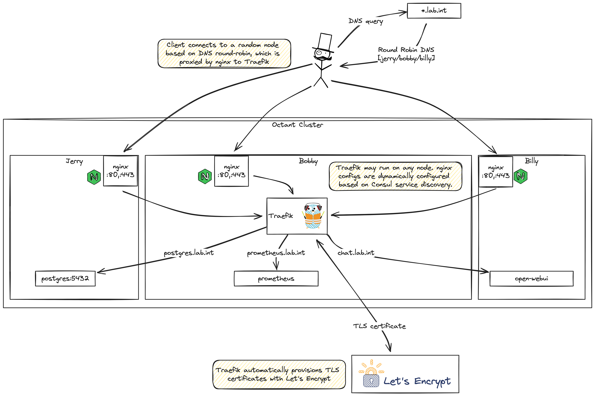
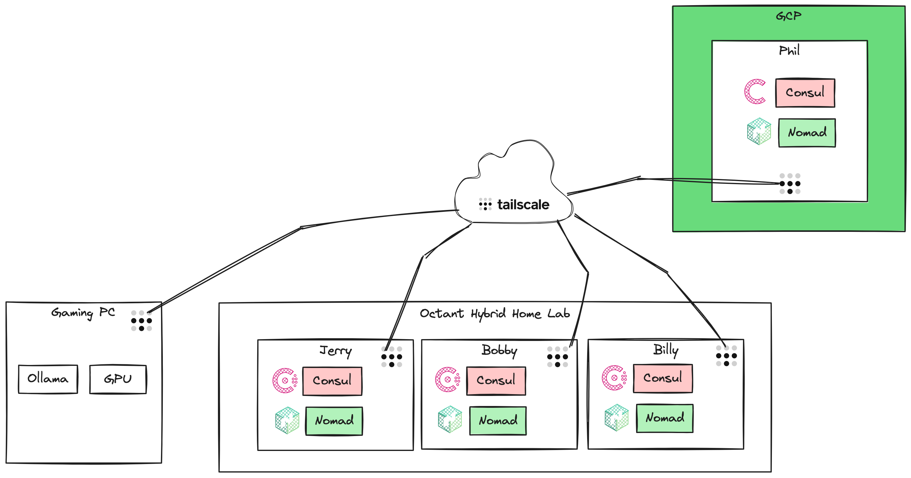
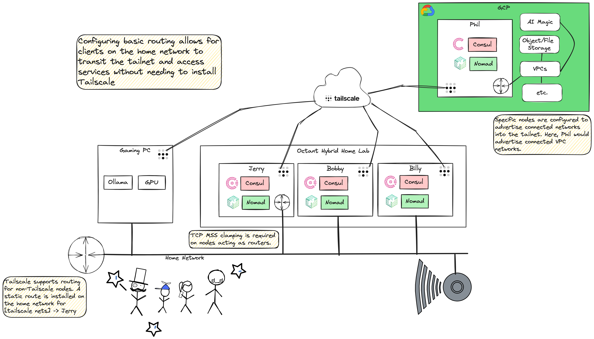
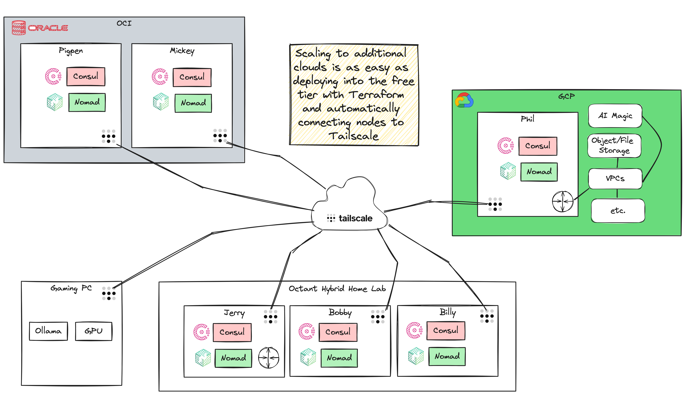
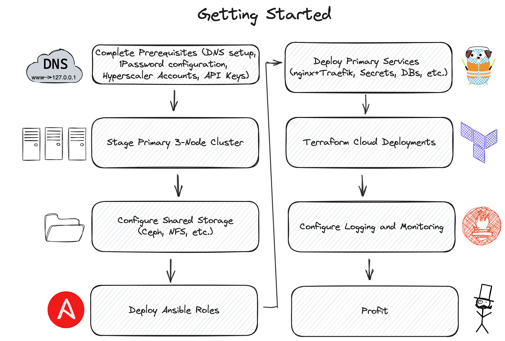

```
 ________  ________ _________  ________  ________   _________
|\   __  \|\   ____\\___   ___\\   __  \|\   ___  \|\___   ___\
\ \  \|\  \ \  \___\|___ \  \_\ \  \|\  \ \  \\ \  \|___ \  \_|
 \ \  \\\  \ \  \       \ \  \ \ \   __  \ \  \\ \  \   \ \  \
  \ \  \\\  \ \  \____   \ \  \ \ \  \ \  \ \  \\ \  \   \ \  \
   \ \_______\ \_______\  \ \__\ \ \__\ \__\ \__\\ \__\   \ \__\
    \|_______|\|_______|   \|__|  \|__|\|__|\|__| \|__|    \|__|
    1password   Consul  Terraform   Ansible    Nomad    Tailscale

                   An opinionated lab framework
```
**WARNING: Batteries are not included. This battlestation is not yet fully functional**

Octant is an open source project that provides automation and infrastructure as code for setting up and managing a lab environment. The project utilizes various tools and technologies such as 1Password, Consul, Terraform, Ansible, Nomad, and Tailscale to create a scalable and flexible lab setup.

## Features

- **Bare metal and VM deployment**: Supports direct bare metal provisioning or automated KVM virtual machines with Packer base images and cloud-init
- **Workload scheduling** via HashiCorp Nomad with Podman driver (rootless by default, root when necessary)
- **Service discovery** via HashiCorp Consul with DNS integration
- **Distributed storage** with CephFS shared across all nodes
- **Ingress**: HAProxy load balancing across nodes, Traefik reverse proxy with LetsEncrypt TLS via Cloudflare DNS
- **40+ service deployments** as Terraform modules: observability stack (Prometheus, Grafana, Loki, Tempo, Alertmanager), AI/ML tools (Open-WebUI, LiteLLM, Phoenix, Graphiti, ChromaDB, Qdrant), productivity apps (Homepage, n8n, Gitea, Linkding), and more
- **Secrets management** with 1Password integration and automated vault seeding
- **Monitoring**: Node-exporter and Podman-exporter with Consul-based Prometheus auto-discovery
- **Database services**: PostgreSQL, MariaDB, Redis, Neo4j, NATS (with JetStream)
- **Automated backups** with Restic (database dumps, Consul/Nomad snapshots, CephFS repo)
- **Configuration management** and provisioning using Ansible with numbered phase playbooks
- **Connectivity** between on-prem and cloud using Tailscale (optional)
- **Cloud infrastructure** in hyperscaler free-tier offerings, deployed with Terraform
- **Pre-commit hooks** for secrets scanning, linting, and code hygiene

## Roadmap

- A much better getting started guide
- Video walkthroughs and demos
- Contributing guide and GitHub issues for roadmap tracking
- Terraform templates for additional hyperscaler free tiers
- Grafana dashboards and intelligent alerting
- Terraform state storage in Consul K/V store

## Getting Started

**NOTE:** Detailed documentation is still a work in progress. Secrets and environment variables are used heavily throughout this project, so unless you are feeling adventurous, please hang tight until this section is more complete.

Octant supports two deployment models:

**Bare metal** (original model): Provision physical nodes, then configure with Ansible.

**KVM virtual machines**: Automated VM lifecycle on a KVM/libvirt hypervisor.

To get started with Octant, follow these steps:

1. Clone the repository: `git clone https://github.com/shamsway/octant`
2. Install dependencies: Ansible, Terraform, Packer, pre-commit
3. Copy `envrc.example` to `.envrc` and configure environment variables
4. Prepare nodes (choose one):
   - **Bare metal**: Configure inventory with your physical hosts
   - **VM**: Build base image (`make build-base-image`) and provision VMs (`make provision-vms`)
5. Deploy Ceph storage: `make deploy-ceph`
6. Configure the cluster: `make deploy`
7. Deploy services: `make deploy-services`

For detailed instructions and documentation, please refer to the [docs](./docs) directory.

## Files and Folders

`docs/`
- Documentation, design plans, and implementation guides

`inventory/`
- Ansible inventory, group variables, and node definitions
- `groups.yml` defines servers, volumes, and resource allocations
- `hypervisors.yml` defines KVM hosts for VM provisioning (VM deployment only)

`packer/`
- Packer templates for KVM base images
- Cloud-init configs and bootstrap scripts

`playbooks/`
- Numbered phase playbooks for the full deployment pipeline
- `site.yml` orchestrates all phases end-to-end

`roles/`
- Ansible roles for infrastructure (consul, nomad, ceph, haproxy, podman) and operations (secrets, volumes, vm_provision, node-exporter)

`scripts/`
- Operational scripts for secret generation, 1Password vault seeding, and state capture

`terraform/`
- Per-service Terraform modules, each containing a Nomad job spec (`.nomad.hcl`), `main.tf`, and `variables.tf`
- `terraform/template/` provides a starter template for new services

`octant.yml`
- The main Ansible playbook for cluster configuration (user accounts, packages, roles)

`Makefile`
- Make targets for the full lifecycle: VM provisioning, cluster deployment, service management, and operations

## Diagrams

Example architecture - initial cluster deployment


Consul/Nomad Architecture


Ingress with nginx and Traefik


Tailscale Overview


Tailscale Routing


Tailscale Multicloud


Getting Started


## FAQ

- Why? Octant was born out of a desire to learn. I wanted a reliable platform to try the numerous AI/LLM projects coming out. I'd used Terraform, but never Consul or Nomad, and this was a chance to learn them. It was also a response to having to rebuild my lab from scratch multiple times. I decided that this time, every part of the lab build would be automated.
- So how much does this thing cost? Octant was mostly built with components I had on hand - a subscription to 1Password (about $60/year), a free Cloudflare account, a free Tailscale account, and bare metal nodes or a server capable of running KVM/libvirt for VM provisioning. I heavily leaned on Claude to design, prototype, write code and troubleshoot. Having a subscription to Claude isn't a requirement, but it is a useful tool and co-pilot. After a few weeks of development, I decided to purchase some mini PCs to replace the VMs I'd started with. Dedicated hardware provides better performance, but Octant is flexible enough to run on VMs, dedicated hardware, or a mix of both. So far, cloud costs have been less than $1.00/month. I am a longtime Backblaze user, so I'm using their S3-compatible B2 service for backups, which is very reasonably priced.
- For the 3-node architecture, are Consul, Nomad, and Ceph all running on the same three nodes, or are they separate clusters? Great question, the answer is a bit complex but it is what makes this environment unique. Both Consul and Nomad use the RAFT protocol for consensus, so the minimum starting cluster size is three. Expanding clusters should respect the requirement for odd numbers of members. Both Consul and Nomad follow a server/agent architecture, but the components can run on the same physical server or VM. Consul and Nomad servers form a quorum for consensus, but do little else. Consul and Nomad agents connect to the servers and perform the service discovery and container scheduling functions. In this Octant framework, each node runs these components: a Consul server, a Nomad Server, a Consul rootless agent, a Nomad rootless agent, a Consul agent running as root, and a Nomad agent running as root. There is always a 1:1 correlation between corresponding Consul and Nomad agents. They work as a pair to perform their functions. Running both a rootless and root pair of each allows each node to be able to run either rootless containers, or those few containers requring root privileges. Ceph is also running to provide distributed storage. Each container (running as a Nomad job) stores stateful data on a cephfs mount shared across all the nodes. An nginx tcp proxy runs on each node on ports 80 and 443, which direct any inbound traffic to traefik.
- How does Traefik interact with the other components in your setup? Is it running on all nodes or on a dedicated node? Traefik runs in a single container becuase clustering isn't supported in the open source version, so nginx is acting as a simple ingress. Traefik uses Consul service discovery and container tags to generate TLS certs and forward inbound traffic to the correct port on the container. Most ports use a random ports, but some containers run on well-known ports.

## Inspiration

These repos/projects were the inspiration behind many of the choices I made when figuring out how I wanted to structure Octant.

- https://github.com/perrymanuk/hashi-homelab
- https://github.com/assareh/home-lab
- https://github.com/abaschen/nomad-consul-vault

## License

This project is licensed under the [MIT License](./LICENSE).
