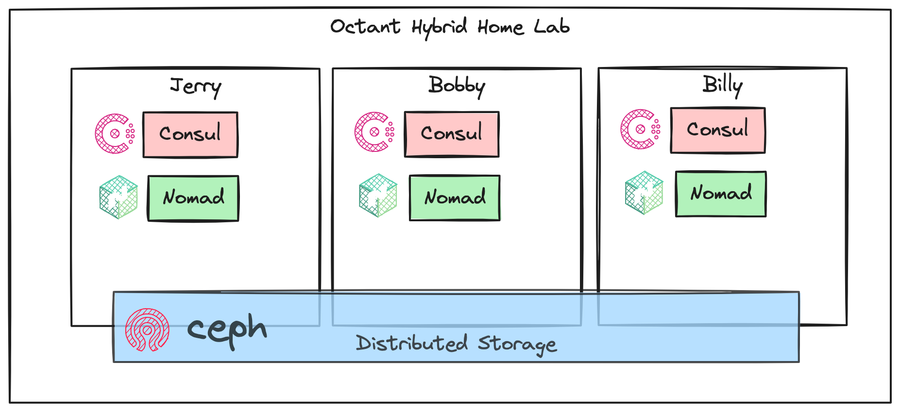
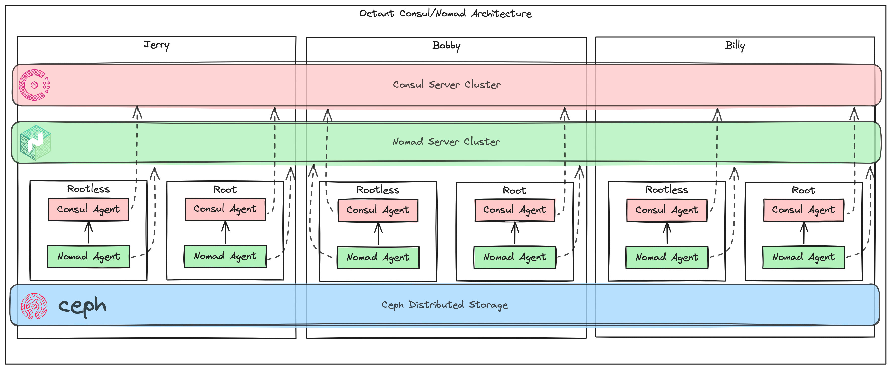

```
 ________  ________ _________  ________  ________   _________   
|\   __  \|\   ____\\___   ___\\   __  \|\   ___  \|\___   ___\ 
\ \  \|\  \ \  \___\|___ \  \_\ \  \|\  \ \  \\ \  \|___ \  \_| 
 \ \  \\\  \ \  \       \ \  \ \ \   __  \ \  \\ \  \   \ \  \  
  \ \  \\\  \ \  \____   \ \  \ \ \  \ \  \ \  \\ \  \   \ \  \ 
   \ \_______\ \_______\  \ \__\ \ \__\ \__\ \__\\ \__\   \ \__\
    \|_______|\|_______|   \|__|  \|__|\|__|\|__| \|__|    \|__|
    1password   Consul  Terraform   Ansible    Nomad    Tailscale

                   An opinionated home lab framework
```
**WARNING: Batteries are not included. This battlestation is not yet fully functional**

Octant is an open source project that provides automation and infrastructure as code for setting up and managing a home lab environment. The project utilizes various tools and technologies such as 1Password, Consul, Terraform, Ansible, Nomad, and Tailscale to create a scalable and flexible home lab setup.

## Features

- Automated deployment of infrastructure components using Terraform
- Workload scheduling via HashiCorp Nomad
- Service discovery via HashiCorp Consul
- Rootless Podman when possible, Root Podman when necessary
- Traefik for reverse proxy and TLS cert generation with LetsEncrypt
- Configuration management and provisioning using Ansible
- Secrets management integration with 1Password
- Connectivity between on-prem and cloud using Tailscale
- Cloud Infrastructure in the major hyperscalers free-tier offerings, deployed with Terraform and automatically connected to Tailscale
- Nomad Jobs for deploying basic components for Local LLM: Vector Database, Redis, Jupyter Notebooks, Ollama (optional)
- Database services: postgres, mariadb, influxdb, redis, chromadb, weaviate
- Monitoring and alerting with Prometheus, Grafana, Loki, LibreNMS and other tools
- Automated backups to S3-compatible endpoints with Restic
- (Optional) Distibuted storage with Ceph

## Getting Started

To get started with Octant, follow these steps:

1. Clone the repository: `git clone https://github.com/shamsway/octant`
2. Install the required dependencies
3. Configure the necessary variables
4. Run the Ansible playbooks to configure the initial cluster
5. Deploy cloud resources with Terraform
6. Deploy services to Nomad

For detailed instructions and documentation, please refer to the [docs](./docs) directory.

## Files and Folders

`docs/`
- Documentation and notes
- Not anywhere near complete
  
`handlers/`
- Ansible handlers

`inventory/`
- Ansible inventory and group variables

`packer/`
- Packer scripts for VMware and Hyper-V images
- Bootstrap scripts

`roles/`
- The roles folder contains the Ansible roles for the initial setup and deployment of services (i.e. Consul, Nomad, Podman).
- Todo: Add README file for each role, explaining its purpose, dependencies, and any specific configuration options.
- Todo: Review the tasks and templates for any sensitive information and replace them with environment variables or secrets.

`terraform/`
- This folder contains Terraform configurations for deploying various services like Loki, Grafana, InfluxDB, Nginx, Postgres, Prometheus, and Traefik.
- Some jobs are a bare Nomad job without a Terraform "wrapper". These jobs can be easily deployed with `nomad job run`, and will be migrated to Terraform in the future.
- Todo: Review the configurations for any sensitive information like API keys, passwords, or tokens, and replace them with environment variables or secrets management.
- Todo: Decide if this folder should be renamed to `services` or `jobs`.

`homelab.yml`
- The main Ansible playbook for setting up the home lab infrastructure
- Uncludes tasks for setting up user accounts, installing required packages, and applying roles to the inventory.
- Todo: add detailed documentation and usage examples.

`inventory/group_vars/all.yml`
- This file contains global variables used across the Ansible inventory.
- It defines common configuration settings like directory paths, user and group details, domain names, and service-specific settings.
- Todo: Add comments to explain the purpose of each variable and provide examples where necessary.

`inventory/groups.yml`
- This file defines the inventory groups and their associated variables.
- It lists the servers and their specific configurations, such as region, Tailscale advertisements, and volume definitions.

`Makefile`
- Various make targets to deploy Ansible roles and other tasks

`.secrets.yml`
- This file contains a secret key for Consul gossip encryption.
- Ensure that this file is excluded from version control and not pushed to any public repository.
- Todo: Move secrets to 1password, if possible.

## Diagrams

Example architecture - initial cluster deployment


Consul/Nomad Architecture


Ingress with nginx and Traefik


Tailscale Overview


Tailscale Routing


Tailscale Multicloud


Getting Started


## To do 
- Create GitHub issues for future work/add roadmap
- Create changelog and automate updates
- Stand up GitHub actions
- 
## FAQ

- For the 3-node architecture, are Consul, Nomad, and Ceph all running on the same three nodes, or do they have separate node clusters? Great question, the answer is a bit complex but it is what makes this lab unique. Both Consul and Nomad use the RAFT protocol for consensus, so the minimum starting cluster size is three. Expanding clusters should respect the requirement for odd numbers of members. Both Consul and Nomad follow a server/agent architecture, but the components can run on the same physical server or VM. Consul and Nomad servers form a quorum for consensus, but do little else. Consul and Nomad agents connect to the servers and perform the service discovery and container scheduling functions. In this lab framework, each node runs these components: Consul server, Nomad Server, Consul rootless agent, Nomad rootless agent, Consul agent running as root, Nomad agent running as root. There is always a 1:1 correlation between corresponding Consul and Nomad agents. They work as a pair to perform their functions. Running both a rootless and root pair of each allows each node to be able to run either rootless containers, or those few containers requring root privileges. Ceph is also running to provide distributed storage. Each container (running as a Nomad job) stores stateful data on a cephfs mount shared across all the nodes. An nginx tcp proxy runs on each node on ports 80 and 443, which direct any inbound traffic to traefik. 
- How does Traefik interact with the other components in your setup? Is it running on all nodes or on a dedicated node? Traefik runs in a single container becuase clustering isn't supported in the open source version, so nginx is acting as a simple ingress. Traefik uses Consul service discovery and container tags to generate TLS certs and forward inbound traffic to the correct port on the container. Most ports use a random ports, but some containers run on well-known ports.

## License

This project is licensed under the [MIT License](./LICENSE).