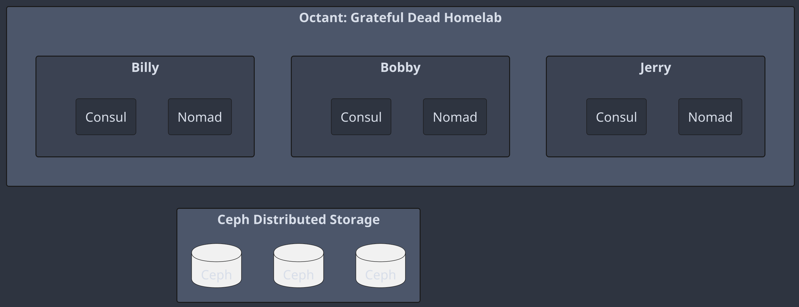

# Octant Hybrid Homelab - Conversation Summary

## Project Overview
- Project Name: Octant
- Acronym Meaning: One password (1Password), Consul, Terraform, Ansible, Nomad, and Tailscale
- Theme: AI focued home lab (with a few tributes to the Grateful Dead because the creator is a Deadhead)

## Basic Homelab Setup
- Three primary servers: Jerry, Bobby, and Billy
- Key components on each server:
  - Nomad
  - Consul
- Shared distributed storage: Ceph

## Diagram Creation Process
1. Started with a basic PlantUML diagram
2. Evolved to use box and participant syntax
3. Implemented a dark mode theme for better aesthetics
4. Simplified service representation
5. Positioned Ceph storage at the bottom of the diagram

## Final Diagram Structure
- Main container: "Octant Hybrid Home Lab"
- Three server containers: Jerry, Bobby, Billy
  - Each contains Nomad and Consul services
- Ceph Distributed Storage at the bottom
  - Represented by three database icons (Ceph1, Ceph2, Ceph3)

## Key Diagram Features
- Dark mode color scheme
  - Background: #2E3440
  - Text and borders: #D8DEE9
- Server containers: #3B4252
- Service boxes: #2E3440
- Ceph storage container: #4C566A
- Font: Arial, size 14
- Diagram size: 800x600

## Next Steps
- Further refinement of Ceph positioning (currently not perfectly centered)
- Potential additions:
  - Representation of other Octant components (1Password, Terraform, Ansible, Tailscale)
  - More detailed service connections or interactions
  - Cloud infrastructure integration

## PlantUML Code (Latest Version)
