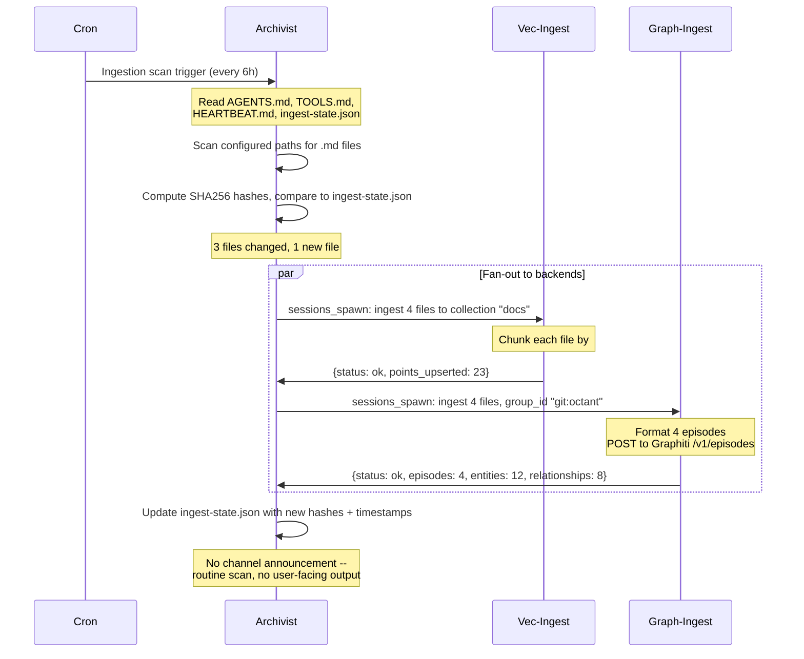
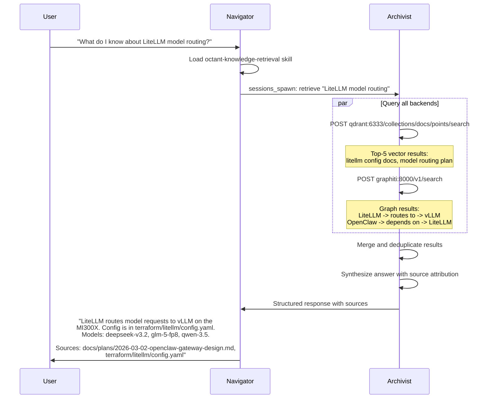
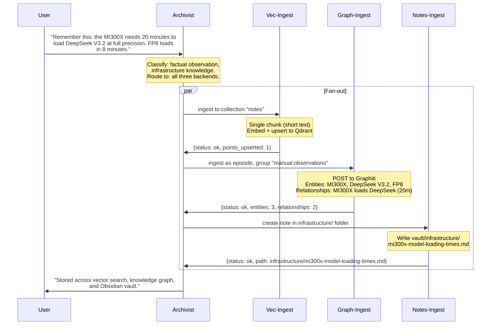
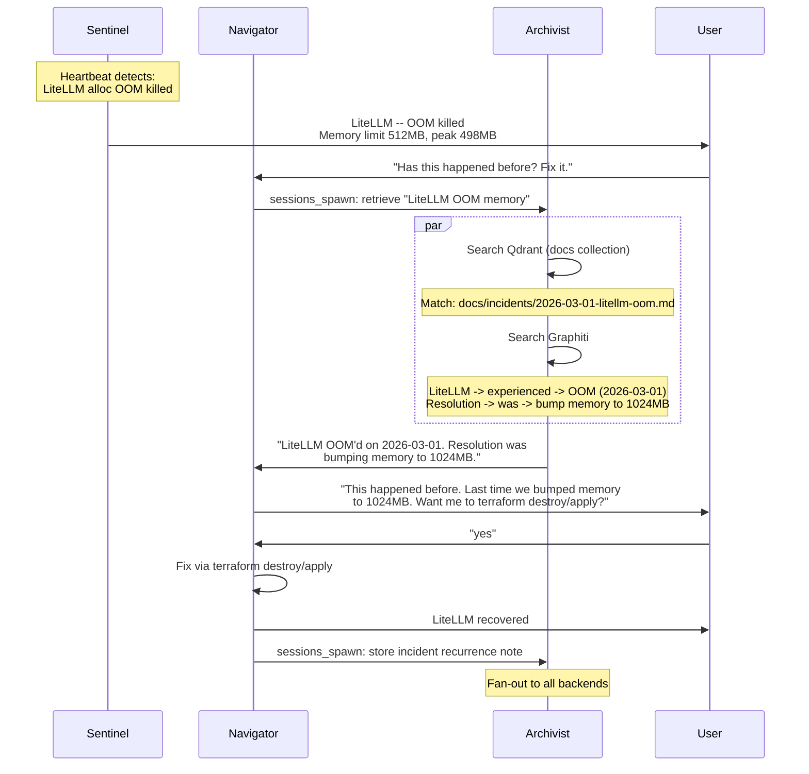
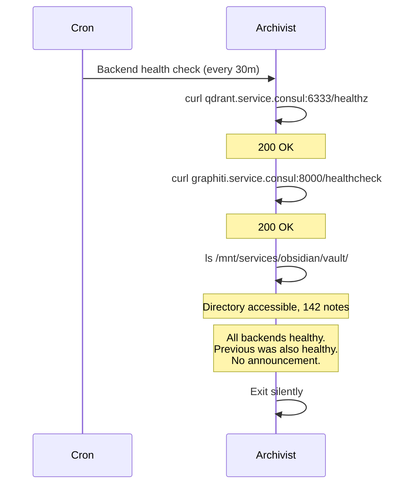

# Agentic Knowledge Layer — High-Level Design

**Date:** 2026-03-05
**Status:** Approved
**Companion:** `2026-03-05-octant-agent-skills-v2-design.md` (ops team design)
**Related:** `2026-02-27-autodeploy-candidates-design.md` (deployed knowledge infrastructure)

## Overview

An agentic knowledge layer for the Octant VM lab. One dedicated OpenClaw agent per storage backend, coordinated by a hub agent (the Archivist). Ingests markdown, text, configs, and technical documentation into vector search (Qdrant), temporal knowledge graph (Graphiti/Neo4j), and structured notes (Obsidian vault on CephFS).

**Target environment:** VM-based Octant lab with deployed knowledge infrastructure (Qdrant, Graphiti, Neo4j, NATS, LiteLLM).

**Runtime:** OpenClaw Gateway. Knowledge agents form a composable "team" that can run standalone or merge with the ops team (Navigator/Sentinel/Bosun).

**Model strategy:** Local-first (vLLM on MI300X), API as fallback. Embedding via `bge-large-en-v1.5` (configurable — changing the embedding model invalidates existing vector data and requires full re-indexing).

**Ingestion:** Hybrid — pull/cron for MVP, NATS event-driven in Phase 2.

**Scope:** Markdown and text only. PDF-to-markdown conversion deferred to later phase.

**Consumers:** Agents primarily. Users interact through agents who synthesize retrieval results.

---

## Architecture

### Agent Topology

```
                    OpenClaw Gateway (Nomad job)

  Team: knowledge

  +-------------+
  |  Archivist   |  Coordinator -- routes store/retrieve requests
  |  (default)   |  Queries all backends, merges results
  +------+-------+
         | delegates via sessions_spawn
         +------------------------------+--------------------+
         |                              |                    |
  +------v------+  +-----------+-------+  +--------+-------+
  | Vec-Ingest  |  | Graph-Ingest      |  | Notes-Ingest   |
  |             |  |                   |  |                |
  | Chunks text |  | Sends episodes    |  | Writes markdown|
  | Embeds via  |  | to Graphiti API   |  | to Obsidian    |
  | LiteLLM     |  | (LLM-powered      |  | vault on CephFS|
  | Writes to   |  |  entity extract)  |  |                |
  | Qdrant API  |  |                   |  |                |
  +-------------+  +-------------------+  +----------------+

  Backends:
    Qdrant      -> qdrant.service.consul:6333 (REST API)
    Graphiti    -> graphiti.service.consul:8000 (REST API)
    Obsidian    -> /mnt/services/obsidian/vault/ (CephFS)

  Model Routing (LiteLLM):
    Embedding:  bge-large-en-v1.5 (configurable)
    Extraction: local large model (Graphiti's internal LLM calls)
    Synthesis:  local large model (retrieval answer generation)
```

### Agent Roles

| Agent | Role | Trigger | Model Size |
|-------|------|---------|------------|
| **Archivist** | Coordinator. Routes "store X" and "find Y" requests. Merges multi-backend retrieval. Maintains ingestion state. | User messages, delegated queries, cron (scan) | Large (70B+) -- query decomposition and synthesis |
| **Vec-Ingest** | Chunks markdown/text into semantic segments. Generates embeddings via LiteLLM. Upserts to Qdrant with metadata. | Delegated by Archivist | Small (8B) -- deterministic chunking |
| **Graph-Ingest** | Sends text as "episodes" to Graphiti REST API. Graphiti handles LLM-powered entity extraction internally. Agent manages source tracking, dedup, and episode formatting. | Delegated by Archivist | Small (8B) -- formatting and API calls |
| **Notes-Ingest** | Writes structured markdown notes to Obsidian vault on CephFS. Handles templates, frontmatter, linking, folder organization. | Delegated by Archivist | Small (8B) -- file operations |

### Key Insight: Graphiti Does the Heavy Lifting

Graphiti has its own LLM-powered extraction pipeline. Graph-Ingest does NOT do entity extraction -- it:
1. Finds new/changed content from sources
2. Formats it as Graphiti episodes (text chunks with metadata)
3. POSTs to `graphiti.service.consul:8000/v1/episodes`
4. Tracks what has been ingested (avoids re-processing)

### Connection to Other Teams

The knowledge team is consumed by other teams, not dependent on them:

```
Ops Team (Navigator/Sentinel/Bosun)
  |
  |  Navigator loads octant-knowledge-retrieval skill
  |  which calls Archivist via sessions_spawn
  |
  v
Knowledge Team (Archivist -> Vec/Graph/Notes Ingest)
  |
  |  Queries backends, returns synthesized results
  |
  v
Navigator presents answer to user
```

---

## Data Flow & Ingestion

### Content Sources

| Source Type | Examples | Ingestion Pattern |
|---|---|---|
| Git repos | octant docs/, plans/, READMEs | Cron scan (MVP), git hook via NATS (Phase 2) |
| Obsidian vault | Manual notes, structured knowledge | Cron scan (MVP), vault watcher via NATS (Phase 2) |
| Technical docs | Blog posts, external references | Manual or URL-based ingestion |
| Config files | Terraform, Nomad HCL, Ansible | Cron scan alongside git repos |
| Scripts/code | Shell scripts, Python utilities | Cron scan alongside git repos |
| Long-term memory | Agent observations, learned facts | Ad-hoc storage via chat |

### MVP: Pull-Based Ingestion (Phase 1)

```
Cron (every 6h) -> Archivist
  |
  +-- Scan configured paths for new/modified .md files since last run
  |   +-- For each changed file:
  |       +-- sessions_spawn Vec-Ingest: chunk + embed -> Qdrant
  |       +-- sessions_spawn Graph-Ingest: format episode -> Graphiti
  |
  +-- Scan Obsidian vault for new/modified notes
  |   +-- Same fan-out pattern
  |
  +-- Update ingestion state (memory/ingest-state.json)
      +-- Track: {source, file_path, last_hash, last_indexed, backends[]}
```

### Phase 2: NATS Event-Driven

| NATS Subject | Producer | Consumer | Payload |
|---|---|---|---|
| `knowledge.ingest.all` | Any source (fan-out) | Archivist | `{source, path, content_type, action: created|updated|deleted}` |
| `knowledge.ingest.vector` | Archivist (routed) | Vec-Ingest | `{text, metadata, collection}` |
| `knowledge.ingest.graph` | Archivist (routed) | Graph-Ingest | `{text, metadata, group_id}` |
| `knowledge.ingest.notes` | Archivist (routed) | Notes-Ingest | `{title, content, folder, tags}` |
| `knowledge.indexed` | Any ingest agent | Archivist (ack) | `{source, path, backend, status}` |

### Retrieval Flow

```
Query: "What do I know about LiteLLM model routing?"
                    |
                    v
              Archivist
                    |
    +---------------+---------------+
    v               v               v
 Qdrant API     Graphiti API    Obsidian search
 (semantic)     (graph traverse) (file grep)
    |               |               |
    +-------+-------+---------------+
            v
      Archivist merges:
        - Top-k vector results (semantic similarity)
        - Graph paths (entity relationships, temporal context)
        - Note matches (structured human-written context)
            |
            v
      Synthesized answer with source attribution
```

### Ingestion State Management

```json
{
  "sources": {
    "git:octant/docs": {
      "last_scan": "2026-03-05T14:00:00Z",
      "files": {
        "docs/plans/2026-03-05-octant-agent-skills-v2-design.md": {
          "sha256": "abc123...",
          "last_indexed": "2026-03-05T14:02:00Z",
          "backends": ["vector", "graph"]
        }
      }
    }
  }
}
```

Content is re-indexed only when the hash changes. Deleted files trigger removal from backends (Qdrant point deletion, Graphiti episode deprecation).

### Chunking Strategy (Vec-Ingest)

| Content Type | Chunk Size | Overlap | Rationale |
|---|---|---|---|
| Markdown docs | ~500 tokens | 50 tokens | Balanced for retrieval precision |
| Code/configs | Per-block (function, resource) | None | Structural boundaries matter more |
| Long-form text | ~800 tokens | 100 tokens | Wider context for narrative content |

Chunking respects markdown structure -- splits on `##` headers first, then paragraph boundaries. Never splits mid-sentence. Each chunk carries metadata: `{source, file_path, section_heading, chunk_index, timestamp, content_type}`.

### Qdrant Collections

| Collection | Content | Embedding Model |
|---|---|---|
| `docs` | Git repo docs, plans, READMEs | bge-large-en-v1.5 |
| `notes` | Obsidian vault notes | Same |
| `configs` | Terraform, Nomad HCL, Ansible | Same |
| `web` | Phase 2: blog posts, tech docs from URLs | Same |

### Embedding Model

Default: `bge-large-en-v1.5` (1024 dimensions, 335M parameters). Runs on vLLM or as a lightweight separate service, proxied through LiteLLM.

**Changing the embedding model invalidates all existing vector data.** When the model changes:
1. All Qdrant collections must be recreated with the new vector dimension
2. All content must be re-indexed from scratch
3. The Archivist's ingest-state.json should be reset to trigger full re-scan

The embedding model is configured in LiteLLM, not hardcoded in the agents. Agents call `POST /v1/embeddings` with a model alias. Changing the alias in LiteLLM config + re-indexing is the full migration path.

---

## Agent Team Strategy

### Team Concept

A **team** is a named collection of agents designed to work together, with a defined hub agent, delegation patterns, and shared skills. Teams are described in a manifest that maps to an `openclaw.json` agent list.

```
teams/
+-- ops/                    # Navigator, Sentinel, Bosun
|   +-- team.md             # Team description, roster, contracts
|   +-- openclaw.agents.json  # Agent list fragment
+-- knowledge/              # Archivist, Vec-Ingest, Graph-Ingest, Notes-Ingest
|   +-- team.md
|   +-- openclaw.agents.json
+-- scotty/                 # Single hub agent (current MVP)
|   +-- team.md
|   +-- openclaw.agents.json
+-- combined/               # Ops + Knowledge merged
    +-- team.md
    +-- openclaw.agents.json
```

A gateway loads one team config. Swapping teams means deploying a different `openclaw.json` with the appropriate agent list. The OpenClaw agent management skill (under development) handles the swap.

### Team Roster

| Team | Agents | Hub | Purpose |
|---|---|---|---|
| **scotty** | Scotty | Scotty | Current MVP. Single demo agent. |
| **ops** | Navigator, Sentinel, Bosun | Navigator | Incident response. Monitor, detect, fix, document. |
| **knowledge** | Archivist, Vec-Ingest, Graph-Ingest, Notes-Ingest | Archivist | Knowledge ingestion and retrieval. |
| **combined** | Navigator, Sentinel, Bosun, Archivist, Vec-Ingest, Graph-Ingest, Notes-Ingest | Navigator | Full stack. Navigator delegates ops to Sentinel/Bosun, knowledge to Archivist. |

### Team Composition

When teams combine, hub agents merge into a delegation hierarchy:

```
Standalone:                          Combined:

ops team:                            Navigator (hub)
  Navigator (hub)                      +-- Sentinel (ops monitor)
    +-- Sentinel                       +-- Bosun (ops maintenance)
    +-- Bosun                          +-- Archivist (knowledge hub)
                                           +-- Vec-Ingest
knowledge team:                            +-- Graph-Ingest
  Archivist (hub)                          +-- Notes-Ingest
    +-- Vec-Ingest
    +-- Graph-Ingest
    +-- Notes-Ingest
```

In combined mode, the Archivist loses "default agent" status and becomes a specialist. Navigator's HANDOFFS.md gets an additional delegation stub:

```markdown
## Archivist Delegation
Request stub:
  task: store | retrieve | scan-status
  content: <text or query>
  backends: [vector, graph, notes] (optional, default: all)
  source: <where this content came from>
Expected return: structured results with source attribution
```

### Avoiding Duplication

| Overlap Area | Ops Team | Knowledge Team | Resolution |
|---|---|---|---|
| **Cron scheduling** | Sentinel heartbeat (15m), Bosun maintenance (daily/6h) | Archivist ingestion scan (6h) | Shared cron/jobs.json. Each entry specifies agent ID. No conflict. |
| **CephFS access** | Bosun disk cleanup on `/mnt/services/<service>/` | Notes-Ingest writes to `/mnt/services/obsidian/vault/` | Different paths. No overlap. |
| **LiteLLM models** | Navigator uses large models for planning | Vec-Ingest uses embedding model, Graphiti manages its own LLM calls | Different model types. No competition. |
| **Documentation** | octant-documentation-writer generates postmortems to `docs/incidents/` | Notes-Ingest writes notes to Obsidian vault | Different outputs. Can wire together later (postmortem -> auto-ingest). |
| **Consul/Nomad** | Core ops function | Not needed by knowledge team | No overlap. |
| **NATS** | Not used by ops (Phase 1) | Event bus for ingestion (Phase 2) | Different subjects (`ops.alerts.*` vs `knowledge.ingest.*`). |

### Agent Categories

| Category | Examples | Lifecycle |
|---|---|---|
| **Team members** | Navigator, Sentinel, Archivist, Vec-Ingest | Persistent. Run in a gateway. Cron, heartbeats, memory. |
| **Generalist hubs** | Scotty | Persistent but solo. Gets replaced by a team when ready. |
| **One-offs** | PDF-to-markdown converter, web scraper, migration scripts | Ephemeral. Spawned for a specific task. Could be a skill or lobster pipeline step. |

### Team Manifest Format

```markdown
# Team: knowledge

## Purpose
Ingest, index, and retrieve knowledge across vector, graph, and note backends.

## Agents
| Agent | Role | Cron | Model |
|-------|------|------|-------|
| Archivist | Hub/coordinator | Every 6h (scan), every 30m (health) | Large |
| Vec-Ingest | Vector embedding | Delegated | Small |
| Graph-Ingest | Graph episodes | Delegated | Small |
| Notes-Ingest | Obsidian notes | Delegated | Small |

## Inter-Agent Contracts
- Archivist -> Vec-Ingest: {task, text, metadata, collection}
- Archivist -> Graph-Ingest: {task, text, metadata, group_id}
- Archivist -> Notes-Ingest: {task, title, content, folder, tags}
- All -> Archivist: {status, backend, items_processed, errors}

## Dependencies
- Qdrant (qdrant.service.consul:6333)
- Graphiti (graphiti.service.consul:8000)
- LiteLLM (litellm.service.consul:4000) -- embedding endpoint
- CephFS (/mnt/services/obsidian/vault/)

## Combines With
- ops: Navigator becomes hub, Archivist becomes specialist
- scotty: Not designed for combination (Scotty is replaced)
```

---

## Agent Workspace Design

### Archivist (Knowledge Hub)

```
archivist/
+-- workspace/
    +-- SOUL.md             # Identity: "I organize, index, and retrieve knowledge"
    +-- AGENTS.md           # Startup sequence, routing table, ingestion protocol
    +-- TOOLS.md            # Qdrant API, Graphiti API, Obsidian paths, LiteLLM embedding
    +-- HEARTBEAT.md        # Ingestion scan + backend health checks
    +-- IDENTITY.md         # Name, emoji, avatar
    +-- USER.md             # Operator preferences
    +-- HANDOFFS.md         # Request stubs for Vec/Graph/Notes delegation
    +-- memory/
        +-- ingest-state.json   # Source tracking: files, hashes, last indexed
        +-- .gitkeep
```

**HEARTBEAT.md:**

| Check ID | Interval | Action | Delivery |
|---|---|---|---|
| ingestion_scan | 6h | Scan sources for new/modified content, delegate to backends | Announce on new content only |
| backend_health | 30m | Verify Qdrant, Graphiti, Obsidian vault accessible | Announce on failure only |

**HANDOFFS.md contracts:**

| Target | Request Stub | Expected Return |
|---|---|---|
| Vec-Ingest | `{task: ingest|delete, text, metadata, collection}` | `{status, points_upserted, collection}` |
| Graph-Ingest | `{task: ingest|deprecate, text, metadata, group_id}` | `{status, episode_id, entities_extracted, relationships_created}` |
| Notes-Ingest | `{task: create|update, title, content, folder, tags, frontmatter}` | `{status, file_path, action: created|updated}` |

### Vec-Ingest

```
vec-ingest/
+-- workspace/
    +-- SOUL.md             # Precise, methodical, handles text at scale
    +-- AGENTS.md           # Chunking protocol, embedding workflow, Qdrant upsert
    +-- TOOLS.md            # LiteLLM /v1/embeddings, Qdrant REST API
    +-- HEARTBEAT.md        # Empty (delegated only)
    +-- IDENTITY.md
    +-- USER.md
    +-- memory/
        +-- .gitkeep
```

**Key AGENTS.md content:**
- Chunking: respect markdown structure (split on `##` first, then paragraphs, never mid-sentence)
- Deterministic point IDs: hash of `source+path+chunk_index` for idempotent re-indexing
- Delete by filter: `{source, file_path}` to remove all chunks for a deleted file

**Key TOOLS.md entries:**
- `POST litellm.service.consul:4000/v1/embeddings` (embedding generation)
- `PUT qdrant.service.consul:6333/collections/{collection}/points` (upsert)
- `DELETE qdrant.service.consul:6333/collections/{collection}/points/delete` (removal)
- `POST qdrant.service.consul:6333/collections/{collection}/points/search` (retrieval)

### Graph-Ingest

```
graph-ingest/
+-- workspace/
    +-- SOUL.md             # Connector of ideas, sees relationships
    +-- AGENTS.md           # Episode formatting, Graphiti API, dedup
    +-- TOOLS.md            # Graphiti REST API endpoints, group_id conventions
    +-- HEARTBEAT.md        # Empty (delegated only)
    +-- IDENTITY.md
    +-- USER.md
    +-- memory/
        +-- .gitkeep
```

**Key AGENTS.md content:**
- Graphiti does entity extraction internally -- do NOT pre-extract entities
- Group ID convention: `{source_type}:{source_name}` (e.g., `git:octant`, `obsidian:vault`)
- Check Archivist's ingest-state.json before submitting (dedup)

**Key TOOLS.md entries:**
- `POST graphiti.service.consul:8000/v1/episodes` (episode ingestion)
- `POST graphiti.service.consul:8000/v1/search` (graph search)

### Notes-Ingest

```
notes-ingest/
+-- workspace/
    +-- SOUL.md             # Careful scribe, structured note-taker
    +-- AGENTS.md           # Note templates, frontmatter schema, folder structure
    +-- TOOLS.md            # CephFS paths, file operations, Obsidian conventions
    +-- HEARTBEAT.md        # Empty (delegated only)
    +-- IDENTITY.md
    +-- USER.md
    +-- memory/
        +-- .gitkeep
```

**Key AGENTS.md content:**
- Vault path: `/mnt/services/obsidian/vault/`
- Folder structure:
  ```
  vault/
  +-- infrastructure/     # Octant docs, plans, runbooks
  +-- agents/             # Agent workspace summaries, lessons learned
  +-- incidents/          # Postmortems (if wired from ops team)
  +-- research/           # Web content, blog posts
  +-- daily/              # Daily notes, logs
  ```
- Frontmatter: `{title, source, created, updated, tags}`
- File naming: kebab-case, no spaces
- Never overwrite without checking diff -- append or create new version if content diverges

### Tool Policies

| Agent | Policy | Rationale |
|-------|--------|-----------|
| Archivist | `profile: coding` + `alsoAllow: [group:web, group:sessions, memory_*, message]` | Orchestration, web for URL fetching, memory for state |
| Vec-Ingest | `allow: [exec, memory_get, memory_search, message]` | Strict. Only curl to Qdrant/LiteLLM + reporting |
| Graph-Ingest | `allow: [exec, memory_get, memory_search, message]` | Strict. Only curl to Graphiti + reporting |
| Notes-Ingest | `allow: [exec, write, edit, read, message]` | File operations for CephFS vault writes |

---

## Agent Interaction Diagrams

### Story 1: Ingest a Git Repo (Cron-Driven)



### Story 2: User Asks a Knowledge Question (via Navigator)



### Story 3: Store Something From Chat



### Story 4: Ops Team Queries Knowledge During Incident



### Story 5: Backend Health Check (Archivist Heartbeat)



---

## Implementation Phases

### Phase 1: Foundation (MVP -- Pull-Based Ingestion)

1. Archivist agent workspace (SOUL.md, AGENTS.md, TOOLS.md, HEARTBEAT.md, HANDOFFS.md)
2. Vec-Ingest agent workspace
3. Graph-Ingest agent workspace
4. Notes-Ingest agent workspace
5. Team manifest (`teams/knowledge/team.md` + `openclaw.agents.json`)
6. Qdrant collection setup (create `docs`, `notes`, `configs` collections with 1024-dim vectors)
7. Obsidian vault directory structure on CephFS
8. LiteLLM config: add `bge-large-en-v1.5` embedding model
9. Cron-driven ingestion scan (Archivist scans, delegates to ingest agents)
10. Retrieval flow: Archivist queries Qdrant + Graphiti, merges results
11. End-to-end test: ingest a doc, retrieve it by semantic query

### Phase 2: Cross-Team Integration

12. `octant-knowledge-retrieval` skill for Navigator (ops team consumes knowledge)
13. Combined team config (`teams/combined/`)
14. NATS event producers (git hook or N8N workflow publishing to `knowledge.ingest.all`)
15. Incident postmortem -> auto-ingest pipeline

### Phase 3: Expansion

16. Web content ingestion (URL scraping, blog posts)
17. PDF-to-markdown one-off agent or lobster pipeline
18. Chat log ingestion (Rocket.Chat history)
19. Obsidian plugin or sync agent for bidirectional management

### Dependencies

| Dependency | Status | Phase |
|---|---|---|
| Qdrant | Deployed | Phase 1 |
| Graphiti + Neo4j | Deployed | Phase 1 |
| LiteLLM | Deployed (needs embedding model added) | Phase 1 |
| CephFS | Deployed (needs vault directory created) | Phase 1 |
| NATS JetStream | Deployed (needs subjects configured) | Phase 2 |
| Ops team (Navigator/Sentinel/Bosun) | Designed, not yet deployed | Phase 2 |
| N8N webhook workflows | Deployed (needs knowledge workflows) | Phase 2 |

### Testing Strategy

| Test | What | How |
|---|---|---|
| Backend connectivity | Qdrant, Graphiti, CephFS reachable | Archivist heartbeat (curl, ls) |
| Vec-Ingest round-trip | Chunk -> embed -> upsert -> search | Ingest known doc, search by content, verify match |
| Graph-Ingest round-trip | Episode -> Graphiti -> search | Ingest text with known entities, verify in graph |
| Notes-Ingest write | Create note -> verify on CephFS | Delegate creation, verify file + frontmatter |
| Dedup | Re-ingest same file -> no duplicates | Ingest, count, re-ingest, count unchanged |
| Retrieval merge | Multi-backend query | Ingest to vector + graph, query Archivist, verify both sources |
| Team swap | Load knowledge config, then combined | Deploy each openclaw.json, verify correct agents respond |
| Embedding model change | Re-index after model swap | Change LiteLLM alias, reset ingest-state, verify new embeddings |

---

## Key Lessons Incorporated

From `AGENT_BEST_PRACTICES.md`:
- Tool policy as behavior enforcement (Vec/Graph/Notes-Ingest use strict `allow` lists)
- Anti-confabulation: never report ingestion counts without real API responses
- Heartbeat discipline: silent on consecutive all-clears, announce on state changes only
- Agent contracts: deterministic request/response shapes in HANDOFFS.md

From `MCP_AGENT_GUIDANCE.md`:
- Document exact API endpoints and payloads in TOOLS.md
- Validate actual operations, not just tool availability

From production homelab experience:
- Graphiti handles its own LLM calls -- don't duplicate that work
- CephFS propagation takes 1-5 seconds (relevant for Notes-Ingest writes)
- Qdrant and Graphiti are stateless containers -- terraform destroy/apply is the standard fix
- Embedding model changes require full re-indexing (document this prominently)
