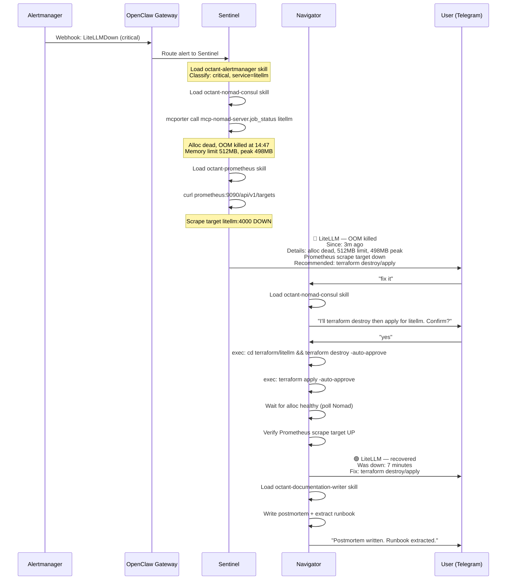
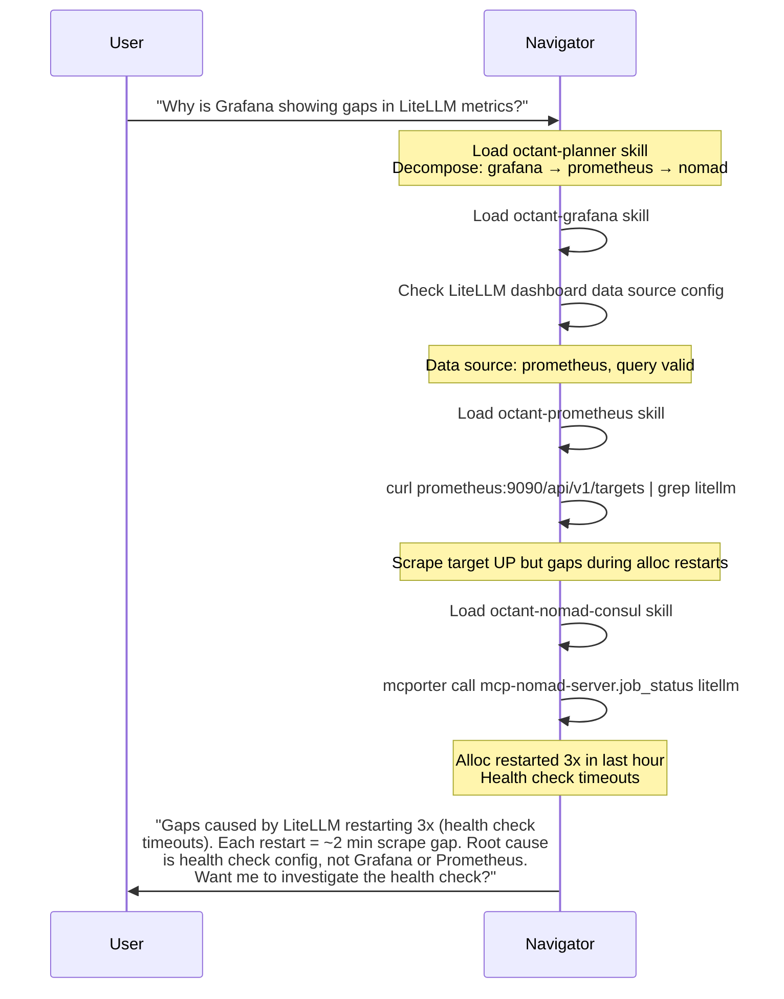
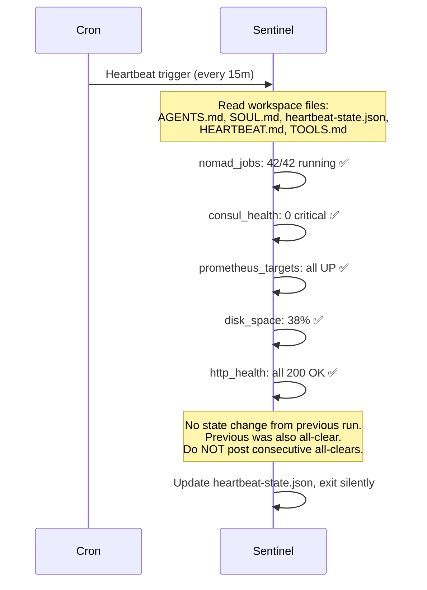
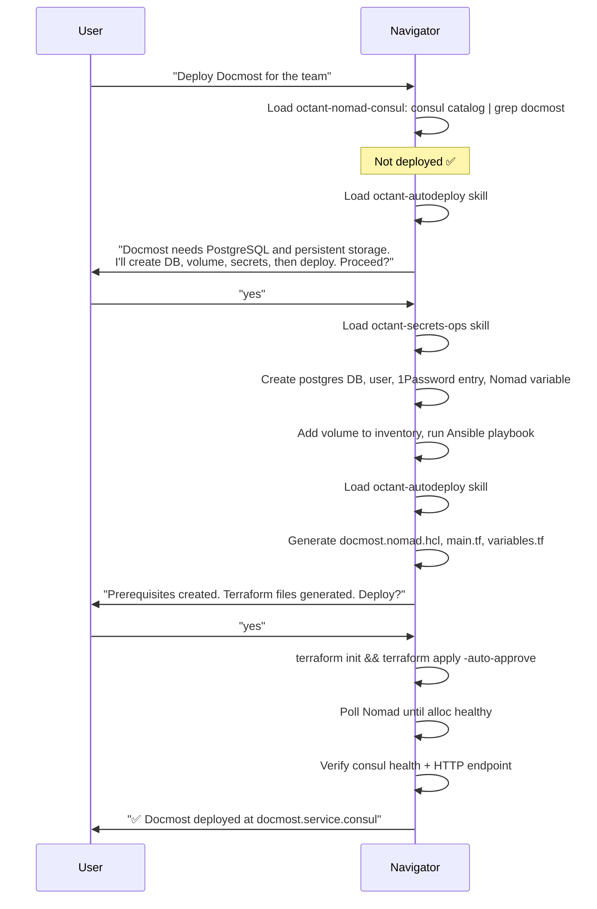
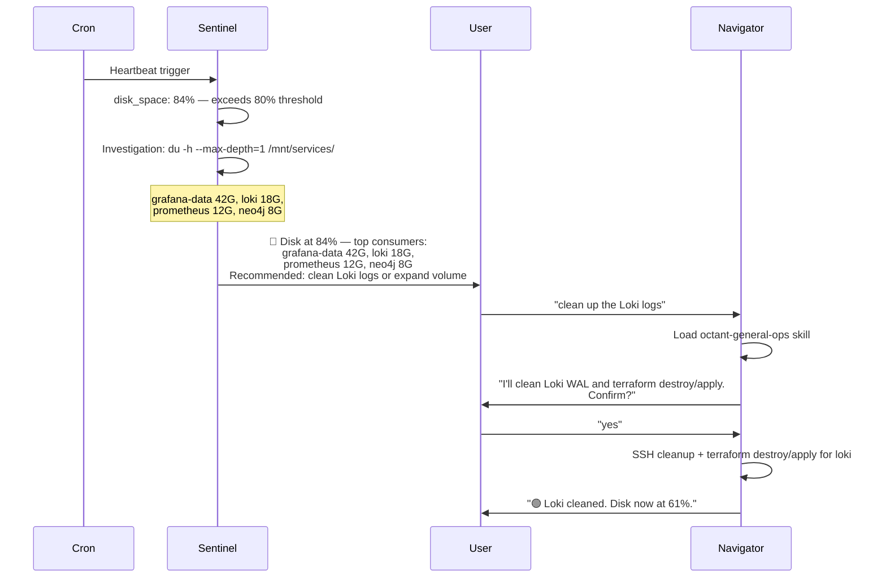

# Octant Agent Skills v2 — High-Level Design

**Date:** 2026-03-05
**Status:** Approved
**Supersedes:** `2026-02-27-octant-agent-skills-design.md` (original 27-skill design)
**Companion:** `2026-02-27-octant-agent-skills-brainstorm.md` (creative concepts, pirate theme)

## Overview

A focused, production-informed agent skills ecosystem for the Octant VM lab. Builds on two foundations:

1. **The openclaw-agents repo** — battle-tested Jerry/Bobby/Billy patterns, AGENT_BEST_PRACTICES, contract-based handoffs, anti-confabulation rules, heartbeat discipline.
2. **The shamsway-plugins marketplace** — 17 octant-* Claude Code plugins encoding deep operational knowledge (autodeploy, consul discovery, postgres/redis/volumes/secrets workflows, validation gotchas, SRE lifecycle).

**Target environment:** New VM-based Octant lab (fresh Nomad/Consul/Traefik stack, same terraform patterns as the production homelab). Aimed at technical demos, not personal use.

**Runtime:** OpenClaw Gateway deployed as a Nomad job. Multi-agent orchestration, channel integrations (Telegram/Discord/Web CLI).

**Model strategy:** Local-first (vLLM on MI300X), API as fallback.

**Primary demo:** Incident response loop (detect → diagnose → fix → document).

**Theme:** Professional first, pirate/Monty Python as optional SOUL.md layer.

---

## Architecture

### Gateway Topology

A single OpenClaw gateway hosting three agents in-process:

```
┌─────────────────────────────────────────────────────────────────┐
│                  OpenClaw Gateway (Nomad job)                    │
│                  WebSocket :18789                                │
│                                                                 │
│  Channels: Telegram / Discord / Web CLI                         │
│                                                                 │
│  ┌─────────────┐  ┌──────────────┐  ┌────────────────┐         │
│  │  Navigator   │  │  Sentinel    │  │  Bosun         │         │
│  │  (planner)   │  │  (monitor)   │  │  (task runner) │         │
│  │  default     │  │  cron-driven │  │  cron-driven   │         │
│  └──────┬───────┘  └──────────────┘  └────────────────┘         │
│         │                                                        │
│         │ loads skills on demand                                 │
│         ▼                                                        │
│  ┌─────────────────────────────────────────────────────────┐    │
│  │                    Skills (10)                            │    │
│  │  octant-planner · octant-nomad-consul · octant-prometheus│    │
│  │  octant-alertmanager · octant-grafana · octant-general-ops│   │
│  │  octant-health-reporter · octant-documentation-writer    │    │
│  │  octant-autodeploy · octant-secrets-ops                  │    │
│  └─────────────────────────────────────────────────────────┘    │
│                                                                 │
│  MCP Servers (mcporter):                                        │
│    mcp-nomad-server  → Nomad cluster ops                        │
│    infra-mcp-server  → system health (disk, CPU, memory)        │
│    context7          → external documentation lookups           │
│                                                                 │
│  Model Routing (LiteLLM):                                       │
│    Primary:  local vLLM on MI300X (Llama 3.x / Qwen / DeepSeek)│
│    Fallback: Anthropic API (Sonnet → Haiku)                     │
│    Override: Opus for complex planning (on-demand)              │
│                                                                 │
│  Observability: LiteLLM → Langfuse callbacks                    │
└─────────────────────────────────────────────────────────────────┘

External Integrations:
  Alertmanager → OpenClaw Gateway API (direct webhook, or N8N fallback)
  Ntfy ← Agent notifications (critical alerts)
```

### Three Agents, Clear Roles

| Agent | Pattern Source | Role | Trigger |
|-------|---------------|------|---------|
| **Navigator** | Jerry | Default agent. Receives user requests, decomposes tasks, routes to skills, synthesizes responses. Spawns sentinel/bosun for delegated work. | User messages |
| **Sentinel** | Bobby | Monitoring heartbeat. Polls Prometheus, Consul, Nomad on cron. Detects incidents, dispatches alerts with investigation data, triggers runbooks. | Cron (every 15m) |
| **Bosun** | Billy | Scheduled maintenance. Image cleanup, log rotation, backup verification, session resets. | Cron (daily/6h) |

### Skills vs. Agents

**Agents** are the three runtime processes with workspace files (SOUL.md, AGENTS.md, TOOLS.md, HEARTBEAT.md). They have persistent identity, memory, and cron schedules.

**Skills** are the knowledge modules that agents load on demand. A skill is a directory with SKILL.md + references/. Skills are stateless — all operational knowledge from the Claude Code plugins gets distilled into these.

### Model Strategy: Local-First

| Agent | Default Model | Rationale |
|-------|---------------|-----------|
| Navigator | Local large (70B+) | Decomposition and routing need good reasoning |
| Sentinel | Local medium (8-32B) | Procedural checks, high frequency, cost-sensitive |
| Bosun | Local small (8B) | Deterministic maintenance tasks, minimal creativity |

LiteLLM handles model aliases and fallback chains. Skills don't specify models — agents do. This keeps skills portable.

---

## Skill Inventory

### Phase 1: 10 Skills (Incident Response Demo)

| # | Skill | Source Plugins | Demo Role |
|---|-------|----------------|-----------|
| 1 | `octant-planner` | New | Routes requests, decomposes cross-domain tasks |
| 2 | `octant-nomad-consul` | octant-autodeploy, octant-consul-discovery | Service discovery, job management, terraform destroy/apply |
| 3 | `octant-prometheus` | prometheus plugin, original design | PromQL queries, scrape targets, alert rules |
| 4 | `octant-alertmanager` | alertmanager plugin, original design | Alert routing, silences, webhook classification |
| 5 | `octant-grafana` | grafana plugin, original design | Dashboard queries, data source verification |
| 6 | `octant-general-ops` | octant-operations, linux-sysadmin | Disk/CPU/memory, file permissions, SSH, DNS |
| 7 | `octant-health-reporter` | Original design (Polly concept) | Status summaries, heartbeat reports |
| 8 | `octant-documentation-writer` | Original design | Incident postmortems, runbook generation |
| 9 | `octant-autodeploy` | octant-autodeploy plugin | Full deploy-from-chat workflow |
| 10 | `octant-secrets-ops` | octant-secrets-management, octant-postgres, octant-redis, octant-volumes | DB creation, secrets, volumes — deployment prerequisites |

### Phase 2: Full Monitoring + Deployment

| Skill | Source |
|-------|--------|
| `octant-loki` | Log queries, pipeline config |
| `octant-tempo` | Trace correlation |
| `octant-litellm` | Model proxy management |
| `octant-traefik` | Ingress routing, TLS |
| `octant-database-ops` | Postgres/MariaDB/Redis admin |
| `octant-volumes` | CephFS volume management |
| `octant-cloudflare-tunnels` | External access |
| `octant-validation` | HCL/Terraform validation |

### Phase 3: Full Vision

| Skill | Source |
|-------|--------|
| `octant-topology` | Service dependency map |
| `octant-skill-developer` | Self-building skill system |
| `octant-observability-lead` | Domain routing (Tier 1) |
| `octant-ai-platform-lead` | Domain routing (Tier 1) |
| Authoring skills | Nomad, alert, dashboard, workflow, playbook authors |

### Per-Skill Content Map

**`octant-planner`** — New (no direct plugin equivalent)
- Routing table mapping user intent → skill
- Decomposition patterns for cross-domain queries
- Delegation protocol (request stubs for sentinel/bosun)

**`octant-nomad-consul`** — From: octant-autodeploy + octant-consul-discovery
- Nomad job lifecycle: status, stop, run, alloc logs
- Consul service discovery: catalog, health checks, DNS
- The terraform destroy/apply remediation pattern (standard fix)
- Variable escaping rules (`${var}` vs `$${var}`)
- Shared infrastructure inventory (never redeploy postgres/mariadb/redis/minio)
- MCP: `mcporter call mcp-nomad-server.*` for job operations

**`octant-prometheus`** — From: prometheus plugin + original design
- PromQL query patterns for common diagnostics
- Scrape target health: `/api/v1/targets`
- Active alerts: `/api/v1/alerts`
- API endpoint: `prometheus.service.consul:9090`

**`octant-alertmanager`** — From: alertmanager plugin + original design
- Alert routing tree inspection
- Silence management
- Webhook payload format (for classifying incoming alerts)
- API endpoint: `alertmanager.service.consul:9093`

**`octant-grafana`** — From: grafana plugin + original design
- Data source verification
- Dashboard query inspection
- Panel data gap diagnosis
- API endpoint: `grafana.service.consul:3000`

**`octant-general-ops`** — From: octant-operations + linux-sysadmin plugins
- Disk diagnostics: `du -h --max-depth=1 /mnt/services/`
- Memory/CPU: `free -h`, `top -bn1`
- File permissions: CephFS ownership (hashi:hashi, UID 2000)
- SSH access patterns to VM lab nodes
- DNS resolution: `dig <service>.service.consul`

**`octant-health-reporter`** — From: original design (Polly concept)
- Structured status summary format
- Aggregates data from Prometheus, Consul, Nomad
- Optional pirate personality via SOUL.md layer
- Health status scale (healthy → degraded → down → dead)

**`octant-documentation-writer`** — From: original design
- Incident postmortem template
- Runbook generation template
- PlantUML architecture diagrams (PlantUML is deployed)
- Outputs to `docs/` directory

**`octant-autodeploy`** — From: octant-autodeploy plugin (core workflow)
- The full 5-phase deployment workflow
- Nomad job templates (web service, database service)
- Terraform templates (main.tf, variables.tf)
- Pre-deployment checklist (consul discovery first, volumes, secrets)
- Docker image compatibility checks
- Post-deploy verification

**`octant-secrets-ops`** — From: octant-secrets-management + octant-postgres + octant-redis + octant-volumes
- 1Password `op` CLI operations
- Nomad variable creation
- PostgreSQL database/user creation
- Redis DB number allocation
- CephFS volume creation via Ansible playbook
- Combined "prerequisites" workflow for new service deployment

### Token Budget

| Skill | SKILL.md Target | References Target |
|-------|-----------------|-------------------|
| octant-planner | ~2000 tokens | ~3000 tokens |
| octant-nomad-consul | ~4000 tokens | ~6000 tokens |
| octant-prometheus | ~3000 tokens | ~4000 tokens |
| octant-alertmanager | ~2500 tokens | ~3000 tokens |
| octant-grafana | ~2500 tokens | ~3000 tokens |
| octant-general-ops | ~3000 tokens | ~4000 tokens |
| octant-health-reporter | ~2000 tokens | ~2000 tokens |
| octant-documentation-writer | ~2000 tokens | ~3000 tokens |
| octant-autodeploy | ~4000 tokens | ~8000 tokens |
| octant-secrets-ops | ~3000 tokens | ~5000 tokens |

Discovery cost at startup: ~10 skills x ~75 tokens = ~750 tokens.

---

## Agent Workspace Design

### Navigator (Planner/Hub)

```
navigator/
├── openclaw.json           # Gateway config (all 3 agents)
├── mcporter.json           # MCP server endpoints for this lab
├── workspace/
│   ├── SOUL.md             # Identity: "I route, coordinate, synthesize"
│   ├── AGENTS.md           # Startup sequence, routing table, safety rules
│   ├── TOOLS.md            # MCP endpoints, exec patterns, mcporter syntax
│   ├── HEARTBEAT.md        # Empty (reactive, not scheduled)
│   ├── IDENTITY.md         # Name, emoji, avatar
│   ├── USER.md             # Operator preferences
│   ├── HANDOFFS.md         # Request stubs for sentinel/bosun delegation
│   └── memory/             # Runtime state (.gitkeep only)
├── cron/
│   └── jobs.json           # Sentinel + Bosun cron schedules
└── exec-approvals.json     # Exec security policy
```

**AGENTS.md key sections:**
- Startup read sequence (AGENTS.md → SOUL.md → TOOLS.md → HANDOFFS.md)
- Routing table: which skill for which domain
- Safety rules: never restart services without confirmation, never modify terraform state directly
- Memory protocol: daily notes only, no MEMORY.md in shared channels
- Standard remediation: `cd terraform/<service> && terraform destroy -auto-approve && terraform apply -auto-approve`
- Delegation discipline: self-contained handoff messages with request stubs

### Sentinel (Monitoring)

```
sentinel/
└── workspace/
    ├── SOUL.md             # Identity: calm observer, evidence-based
    ├── AGENTS.md           # Heartbeat protocol, alert discipline, anti-confabulation rules
    ├── TOOLS.md            # mcporter calls (nomad, infra), ssh-exec patterns
    ├── HEARTBEAT.md        # Check definitions with IDs, intervals, thresholds
    ├── IDENTITY.md
    ├── USER.md
    └── memory/
        └── heartbeat-state.json  # Runtime: lastChecks, activeAlerts, cooldowns
```

**HEARTBEAT.md checks:**

| Check ID | Interval | Threshold | Cooldown |
|----------|----------|-----------|----------|
| nomad_jobs | 5m | Any non-running alloc | 30m |
| consul_health | 5m | Any critical check | 30m |
| prometheus_targets | 5m | Any target down | 30m |
| disk_space | 10m | >80% | 30m |
| http_health | 5m | Any endpoint down | 30m |

**Alert discipline (from AGENT_BEST_PRACTICES):**
- Multi-stage escalation: Observe → Warn → Alert → Escalate
- Investigation data included in alerts (not separate round-trip)
- Cooldown windows prevent alert spam
- Do NOT post consecutive all-clears
- Calm is a feature — routine events are not emergencies

**Anti-confabulation rules (from Bobby production):**
1. Do not record a remediation action without a real response from the tool call
2. Do not assume a previous session took an action without checking state files
3. A service recovering does not prove the agent fixed it
4. Do not write fabricated entries to state files

### Bosun (Task Runner)

```
bosun/
└── workspace/
    ├── SOUL.md             # Identity: steady rhythm, precise execution
    ├── AGENTS.md           # Task definitions, execution rules
    ├── TOOLS.md            # SSH patterns, cleanup commands
    ├── HEARTBEAT.md        # Scheduled task queue
    ├── IDENTITY.md
    ├── USER.md
    └── memory/
        └── task-state.json # Runtime: last execution timestamps
```

**Scheduled tasks:**

| Task | Schedule | Delivery |
|------|----------|----------|
| sentinel_session_reset | Every 6h | Silent |
| image_cleanup | Daily | Silent |
| log_cleanup | Daily | Silent |
| backup_verify | Daily 5am | Announce on failure |

### Tool Policies

| Agent | Policy | Rationale |
|-------|--------|-----------|
| Navigator | `profile: coding` + `alsoAllow: [group:web, group:sessions, memory_*, message, agents_list]` | Full orchestrator, needs A2A and messaging |
| Sentinel | `profile: coding` + `alsoAllow: [group:sessions, memory_*, message]` + `deny: [write, edit]` | Monitors and alerts, should not modify files |
| Bosun | `profile: coding` + `alsoAllow: [group:sessions, memory_*, message]` | Executes scoped maintenance, needs exec for SSH |

### Cron Configuration

| Job | Agent | Schedule | Delivery |
|-----|-------|----------|----------|
| Heartbeat check | Sentinel | Every 15m | Announce if alert/change |
| Session reset | Bosun | Every 6h | Silent |
| Image cleanup | Bosun | Daily | Silent |
| Log cleanup | Bosun | Daily | Silent |
| Backup verify | Bosun | Daily 5am | Announce on failure |

Every cron payload includes an explicit startup read sequence and "do not write any text before reading files and running checks."

---

## Incident Response Demo Flow

### The Cycle

```
DETECT → DIAGNOSE → FIX → DOCUMENT
```

**Detection triggers:**
- Alertmanager webhook → OpenClaw Gateway API (direct, or N8N fallback)
- Sentinel heartbeat cron (every 15m)
- User asks Navigator directly

**Standard remediation:** Most problems in this lab are fixed by terraform destroy followed by terraform apply. This is the default, not a last resort.

**Common issue categories:**
- Resource exhaustion (OOM, CPU limits)
- File permissions on CephFS volumes
- Disk filling up

**Approval gates:** Destructive operations always require user confirmation in channel. Autonomous for read-only investigation, alert posting, and documentation generation.

---

## Agent Interaction Diagrams

### Story 1: Automated Incident Response (Primary Demo)



### Story 2: User Asks a Cross-Domain Question



### Story 3: Heartbeat Check (Routine, No Incident)



### Story 4: Deploy a New Service From Chat



### Story 5: Disk Filling Up (Sentinel Detects)



---

## Skill Structure

### Skill Template

```yaml
---
name: octant-<name>
description: >
  <Action verbs>. Use when <triggers>.
  Covers <scope>.
---
```

```markdown
You are an expert <domain> engineer managing <service> in the Octant
VM lab. Help diagnose and resolve issues with <service>.

For <adjacent concern>, route to `octant-<other-skill>`.

## Environment Context

- Deployment: Nomad job via Terraform in terraform/<service>/
- Service address: <service>.service.consul
- Standard fix: cd terraform/<service> && terraform destroy -auto-approve && terraform apply -auto-approve
- Storage: /mnt/services/<service>/ (CephFS)

## Common Issues

### Resource Exhaustion
<specific signs and investigation commands>

### File Permissions
<CephFS ownership patterns, hashi:hashi UID 2000>

### Disk Filling Up
<du commands with --max-depth=1, cleanup procedures>

## Key Operations
...

## Troubleshooting
...
```

### Directory Structure

```
skills/octant-<name>/
├── SKILL.md              # Frontmatter + preamble + operational knowledge
└── references/           # Optional deeper reference docs
    ├── queries.md        # Example PromQL/LogQL/etc.
    ├── troubleshooting.md
    └── runbooks/         # For sentinel-consumed skills
```

### Claude Code Plugin → OpenClaw Skill Adaptation

```
Claude Code Plugin                    OpenClaw Skill
─────────────────────                 ──────────────────────────
Tool surface: Read, Write,      →     Tool surface: exec, mcporter,
  Bash, Grep, Glob                      sessions_spawn, message

Addresses: configurable via     →     Addresses: VM lab Consul DNS
  CLAUDE.md                             hardcoded in SKILL.md

Implicit context: CLAUDE.md     →     Explicit context: SKILL.md
  loads automatically                   preamble + references/

Interactive: user approves      →     Conversational: agent asks
  each tool call                        in channel before acting
```

### Validation

- Skills validated with `skill-tools.py check` (frontmatter S1-S11)
- Agent workspaces validated with `agent-contract-linter.py` (request stubs, output contracts, caller/delegate coverage)

---

## Optional Pirate Theme

The theme lives entirely in SOUL.md files — swappable without changing operational logic.

```
Professional SOUL.md:
  "I am the Navigator. I route requests, decompose tasks, and
   synthesize results."

Pirate SOUL.md:
  "I am the Navigator of the good ship Octant. I chart our course
   through the wide cluster-sea."
```

Theme files in a `theme/` directory alongside professional defaults:

```
theme/
  navigator-soul-pirate.md
  sentinel-soul-pirate.md
  bosun-soul-pirate.md

skills/octant-health-reporter/references/
  status-format.md          # Professional
  theme-pirate.md           # Dead Parrot Scale (opt-in)
```

---

## Directory Layout

```
skills/                          # AgentSkill-spec skill directories
  octant-planner/
  octant-nomad-consul/
  octant-prometheus/
  octant-alertmanager/
  octant-grafana/
  octant-general-ops/
  octant-health-reporter/
  octant-documentation-writer/
  octant-autodeploy/
  octant-secrets-ops/
navigator/                       # Agent workspace
  openclaw.json
  mcporter.json
  workspace/
  cron/
sentinel/
  workspace/
bosun/
  workspace/
theme/                           # Optional pirate SOUL.md variants
docs/plans/
  2026-03-05-octant-agent-skills-v2-design.md
```

---

## Implementation Phases

### Phase 1: Foundation (MVP for Incident Response Demo)

1. Gateway config (openclaw.json, mcporter.json, cron jobs)
2. Navigator agent workspace (SOUL.md, AGENTS.md, TOOLS.md, HANDOFFS.md)
3. Sentinel agent workspace (+ HEARTBEAT.md with check definitions)
4. Bosun agent workspace (+ HEARTBEAT.md with task queue)
5. Core skills: octant-planner, octant-nomad-consul, octant-prometheus, octant-general-ops, octant-health-reporter
6. Webhook integration (direct gateway API or N8N fallback)
7. End-to-end test: break a service, watch the cycle

### Phase 2: Full Monitoring + Deployment

8. Remaining skills: octant-alertmanager, octant-grafana, octant-documentation-writer, octant-autodeploy, octant-secrets-ops
9. Pirate theme SOUL.md variants
10. Runbook library in octant-nomad-consul/references/runbooks/

### Phase 3: Expansion Toward Full Vision

11. octant-loki, octant-tempo, octant-litellm, octant-traefik
12. octant-database-ops, octant-volumes, octant-cloudflare-tunnels
13. octant-topology (service dependency map)
14. octant-skill-developer (self-building system)

---

## Testing Strategy

Skills: `skill-tools.py check` (frontmatter, structure)

Agent workspaces: `agent-contract-linter.py` (contracts, coverage)

End-to-end per user story:
- Story 1: Stop a Nomad job → verify detection → diagnosis → fix → document
- Story 3: Heartbeat on healthy cluster → verify no spurious alerts
- Story 4: Deploy a test service → verify full workflow
- Story 5: Fill disk artificially → verify threshold detection

---

## Key Lessons Incorporated

From `AGENT_BEST_PRACTICES.md`:
- Tool policy as behavior enforcement (not convenience)
- `alsoAllow` vs `allow` distinction
- Heartbeat discipline: cooldowns, multi-stage escalation, calm as a feature
- Anti-confabulation rules in workflow files
- Cron prompt discipline: explicit startup read sequence, no startup announcements
- Alert format: include investigation data, not bare thresholds
- Memory security: MEMORY.md in main sessions only
- Agent contracts: deterministic request/response shapes

From `MCP_AGENT_GUIDANCE.md`:
- MCP paths must be real in the runtime (mcporter + exec)
- Document exact commands in TOOLS.md
- Validate actual operations, not just tools/list

From production homelab experience:
- terraform destroy/apply is the standard fix
- Common issues: resources, permissions, disk
- N8N as webhook glue (already deployed, visual workflow builder)
- Most problems are bread-and-butter ops, not exotic failures
